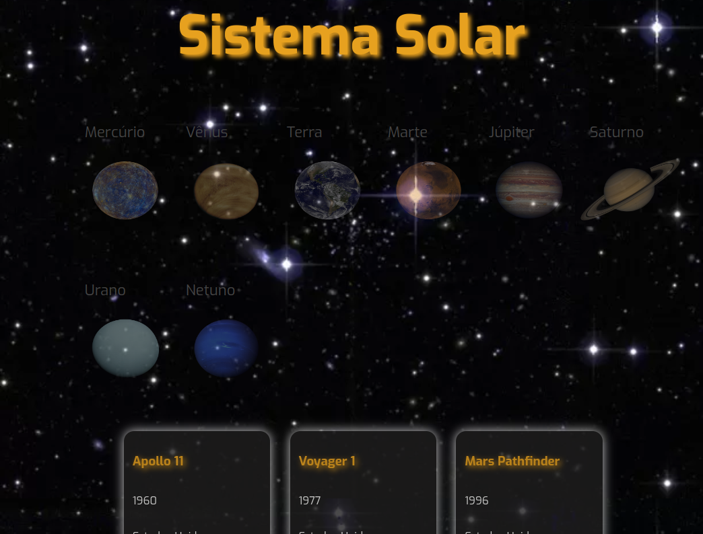

# Solar System

Aplicação em React com criação de componentes de classe e passagem de props.

Essa aplicação simulará uma visualização do **Sistema Solar**, bem como informações sobre diversas missões espacias que ocorreram ao longo da história.

## 🚀 Tecnologia

- ⚡ React é uma biblioteca JavaScript de código aberto focada na criação de interfaces de usuário em páginas da web.

- ⚡ HTML é a linguagem base para se desenvolver qualquer site. 

- ⚡ CSS é uma linguagem de folha de estilo composta por “camadas”, criado com o propósito de estilizar as páginas HTML.

## ✋🏻 Pré-requisitos

- [git](https://git-scm.com/downloads): Ferramenta para gerenciar o código-fonte

- [Visual Studio Code](https://code.visualstudio.com/): Editor de Código Fonte
- [React](https://reactjs.org/)

## :hammer_and_wrench: Este projeto foi iniciado com [Create React App](https://github.com/facebook/create-react-app).

No diretório do projeto, instale as dependências e inicialize o projeto:

### `npm install`

Instala as dependências.

### `npm start`

Executa o aplicativo no modo de desenvolvimento.

Abra [http://localhost:3000](http://localhost:3000) para visualizá-lo em seu navegador.

### `npm test`

Inicia o executor de teste no modo de exibição interativa.

Veja a seção sobre [Executando testes](https://facebook.github.io/create-react-app/docs/running-tests) para mais informações.
